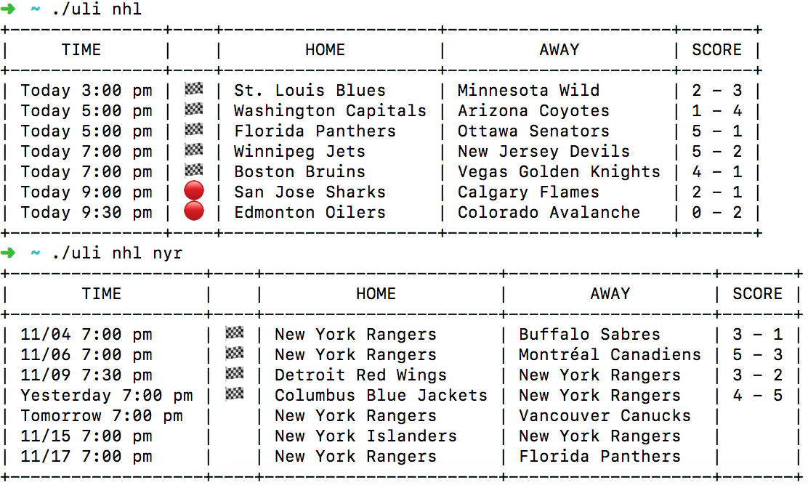

# Uli

An easy-to-use command line tool for fetching real-time sports information 

## Motivation

I recently switched to DuckDuckGo for my internet searches. One thing I miss about Google is its ability to show me today's sports games. Uli solves this problem by providing easy access to sports information in the terminal.

## Usage

You can also alias Uli commands to make them even shorter by adding lines like this to your .bashrc or .zshrc files:

    alias nhl='uli nhl'
    alias nyr='uli nhl nyr'

## Supported Spots

    * NHL

## Building

**Uli requires Go 1.11 or higher.**

1. Make a workspace directory somewhere, e.g. `~/workspace/uli`
2. Create a home for the source following Go conventions: `mkdir -p ~/workspace/uli/github.com/dimes`
3. Check out the code `cd ~/workspace/uli/github.com/dimes && git clone git@github.com:dimes/uli.git`
4. `cd ~/workspace/uli/github.com/dimes/uli`
5. `go mod download`
6. `go run uli.go nhl` should successfully build and run
